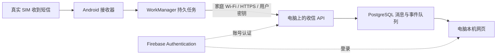

# 把专用 Android 手机变成家庭短信收件箱：我的 httpSMS 本地部署教程

我用一台 Solana Seeker 和家里的 Windows 电脑，做了一个可以在电脑浏览器查看手机新短信的收件箱。短信仍由真实 SIM 卡接收，手机负责上传，电脑负责保存和展示。

这次做的是仅收信的本地加固修改版。原项目支持更多功能；这里的部署脚本、网络隔离、补传和恢复流程属于本次修改，不能仅克隆上游仓库就获得全部效果。[公开修改版源码](https://github.com/316878750/httpsms-home) 已包含应用和部署脚本。本文介绍原理和开发经验；首次安装按 [逐步复现教程](../deploy/local/README.md)，使用自己的 Firebase 配置构建 APK。

## 1. 它怎么工作



手机收到新短信后，建立持久上传任务。任务携带稳定的消息 ID；电脑确认接收成功后，手机才结束任务。手机断网时先排队，恢复网络后重试。后端按用户和消息 ID 去重，避免同一任务重试时产生重复消息。

WorkManager 适合这类需要持续保存、重试的后台工作，但 Android 后台运行仍受系统约束。[Android 官方说明](https://developer.android.com/develop/background-work/background-tasks/persistent)

Firebase 在这里承担账号认证，项目也保留 FCM 配置。收信上传走手机到家庭电脑的 HTTPS 通道；FCM 在上游架构主要用于向 Android 下发发送任务，不能把收到的每条短信都理解成经由 FCM 转发。[上游项目](https://github.com/NdoleStudio/httpsms)、[FCM 官方介绍](https://firebase.google.com/docs/cloud-messaging)

这套方案不提供虚拟号码，也不能让一张国内 SIM 自动变成其他国家号码。验证码能否收到，取决于真实号码、运营商和发送平台。

## 2. 开始前准备什么

| 准备项 | 用途 |
|---|---|
| 专用 Android 手机和能正常收短信的 SIM | 接收新短信；本次设备为 Seeker |
| Windows 电脑、足够磁盘与内存 | 运行容器、网页和数据库，构建 Android 应用 |
| 家庭路由器与同一 Wi-Fi | 手机访问电脑，建议给电脑保留固定地址 |
| USB 数据线、开发者选项、USB 调试 | adb 检查和安装 APK |
| Git、Docker Desktop、Android SDK、JDK、Gradle | 获取代码、运行后端、构建应用 |
| 自有 Firebase 项目 | Web/Android 配置、认证与后端服务账号 |
| 另一台能发短信的设备 | 验证正常收信、断网补传和重启恢复 |

Docker Desktop 的系统、虚拟化和 WSL 条件应按当时的官方安装说明核对。[Windows 安装要求](https://docs.docker.com/desktop/setup/install/windows-install/)

我把大型工具和数据放在 D 盘：Docker 程序及数据盘、Android SDK、JDK、Gradle 缓存、源码和构建输出。安装位置和数据盘位置要分别设置；Windows 组件和少量配置仍可能占用 C 盘。不要为了搬迁工具删除已有 WSL 数据。

Android 工具版本以仓库配置为准。本次代码基线用到 SDK 37、Gradle 9.7 和 JetBrains JVM 25；只安装一个 JDK 并不代表构建环境齐全。新版本源码可能调整这些要求。

## 3. 获取代码并确定范围

```powershell
git clone https://github.com/316878750/httpsms-home.git
```

修改版的上游基线提交为 `8f44d83091deac7a8c6491fb3c5fa85f1ed08a53`。固定版本有助于复现；升级时重新检查依赖和行为。

本次修改集中在三处：Android 接收和后台任务、Go 后端与持久队列、Nuxt 网页与本地部署。原仓库包含发送短信及外部集成能力，我的用途是接收短信，因此同时限制手机权限和后端接口。

开始改之前先确认：只处理新收到的短信、是否需要发送功能、网页访问范围、凭据存放位置和数据保留方式。本文后续都按“仅收信、本机网页、家庭网络手机入口”实施。

## 4. 配置自己的 Firebase

1. 创建项目。此用途不需要启用 Google Analytics。
2. 注册 Web 应用，保存客户端配置，用于网页登录。
3. 在 Authentication 启用邮件/密码登录，建立自己的用户账号，为本机网页配置 `localhost` 授权域。
4. 注册 Android 应用，包名必须与实际源码一致，将自己的 `google-services.json` 放入 Android 构建要求的位置。
5. 确认 Firebase Cloud Messaging API（HTTP v1）已启用。
6. 为后端准备服务账号凭据，限制本地文件访问权限。

Android 注册及配置文件步骤参考官方说明。[Firebase Android 配置](https://firebase.google.com/docs/android/setup)

Web 配置、Android 配置、后端服务账号必须属于同一个项目。客户端配置与服务账号私钥不同：服务账号私钥不能放到网页、APK、公开仓库或截图里。手机使用自己的用户 API 密钥，不能使用系统管理密钥。

## 5. 做成本地加固部署

本次部署运行 PostgreSQL、Redis、API、Web 和 Caddy 五类容器。入口划分如下，地址仅为示例：

| 入口 | 用途与范围 |
|---|---|
| `https://localhost:8443` | 本机浏览器访问网页与通用 API |
| `https://192.168.1.50:8444` | 手机注册、收信上传、心跳；限家庭网卡与子网，要求认证 |
| 数据库、Redis、内部事件接口 | 容器内部使用，不向宿主机公开数据库端口 |

手机入口需要双重保护：代理限制允许的方法和路径，宿主机防火墙限制家庭来源。Docker 可能把请求源地址改写成网关地址，所以不能只依赖代理看到的 IP，也不能遇到 403 就放开所有来源。

清除的组件包括外部日志、Analytics、追踪、营销及不需要的实时服务。网页改为定时轮询本地 API。移除后要检查编译依赖和运行链路；本次删除 Analytics 后，补齐了仍需要的 Google Play 基础依赖。

Firebase Authentication 等外部服务仍然存在，因此“本地存储”不等于完全离线。默认数据库中的短信正文是明文，HTTPS 保护传输；本文没有宣称默认端到端加密。

## 6. HTTPS 和证书

使用本地 CA 签发家庭入口证书。Windows 安装公开根证书；Android 安装同一公开根证书，并在应用网络安全配置里只为指定家庭地址允许用户 CA。

```powershell
# 在对应修改版工作区内执行，路径按实际导出位置调整
certutil -user -addstore Root .local/home-ca.crt
```

不向手机传入 CA 私钥，不全局关闭 TLS 验证，也不以浏览器忽略证书警告作为完成标准。固定电脑地址后再配置证书；地址改变时，证书主机名、手机服务器地址和代理绑定都需要同步。

本次遇到过两个容易混淆的故障：电脑网卡保留了旧 IP，但实际没有连接 Wi-Fi；以及 TLS 已正常，Docker 源地址改写仍使请求被拒。前者查物理连接，后者查防火墙与代理规则。

## 7. 完善补传和去重

Android 端用 WorkManager 保存上传任务，每条新短信生成一个稳定 UUID。网络失败、服务器异常或不合法响应时按退避策略重试；只有 HTTP 成功且响应里包含合法消息 ID 才视为交付成功。

任务保存所属账号和服务器信息。用户更换账号或服务器后，旧任务不能直接上传给新目标。

后端在一个数据库事务中保存消息与持久化事件。用用户和稳定 ID 去重；事件队列通过租约与重试恢复未完成工作。这样解决的是已捕获短信的重试链路，并不能承诺运营商、Android 系统或所有应用状态下永不丢短信。

## 8. 构建、签名、安装

先检查最终合并 Manifest，确认本次仅收信 APK 不含 `SEND_SMS` 和 `READ_SMS`；后端也阻止发送及外部集成接口。正式包应关闭 debuggable，保留自己的签名身份并递增版本号。

下面命令依赖本次修改版脚本，不能直接在未经修改的上游仓库执行：

```powershell
# 使用自己的家庭地址；已有配置先备份，不覆盖凭据
.\deploy\local\Prepare-Local.ps1 -LanIP 192.168.1.50 -LanCidr 192.168.1.0/24
# 填入自己的 Firebase 配置后启动
.\deploy\local\Start-Local.ps1
.\deploy\local\Build-Release.ps1 -VersionCode 2
# APK 路径及设备序列号替换为自己的
adb -s DEVICE_SERIAL install -r PATH_TO_RELEASE_APK
```

编译内存不足时，降低 worker 数、减少 JVM 并发并使用 Kotlin 进程内编译，比重复启动更多 daemon 有效。已有 debug 包迁移正式签名需要处理签名 lineage 与签名权限继承；不能简单卸载，否则可能丢失配置和未上传任务。新安装不需要继承别人的签名。

签名私钥和密码保存在受限本地目录并备份，后续升级复用。公开 APK 不应包含后端服务账号、系统管理密钥或个人收件数据。

## 9. 验证电脑自动恢复

本次首次电脑重启暴露了自启动问题：已有启动项没有真正执行。修复后使用当前用户登录计划任务，等待网卡和 Docker 就绪，再恢复服务。

验收不能只看任务存在，也不能靠手动启动后宣称自动恢复成功。需要真实重启、登录 Windows，检查新启动时间、任务退出结果、服务健康与历史短信数量。

修改版对应命令为：

```powershell
.\deploy\local\Enable-LoginRecovery.ps1
```

这是登录后恢复机制，电脑只开机停留在登录界面时不应假定服务已就绪。

## 10. 我的实际验收结果

2026 年 10 月 6 日完成以下有限场景测试：

| 场景 | 结果 |
|---|---|
| 普通测试短信 | 本机网页可以看到 |
| Seeker 锁屏并关闭 Wi-Fi | 恢复网络后，不打开应用也能补传，测试消息只保存一次 |
| Seeker 真实重启 | 首次解锁后，不打开应用，新测试短信可以收到 |
| Windows 再次真实重启 | 登录任务自动恢复服务，HTTPS 可用，三条测试短信保留 |

这些结果证明这套设备和当前版本通过了测试，不代表所有机型、所有短信来源都已验证。测试使用普通短信，不需要发送真实银行验证码。

## 11. 日常怎么用

1. 手机保持 SIM 正常、接入家庭 Wi-Fi，确认后台权限没有被系统收回。
2. 电脑开机并登录 Windows，等待 Docker 和本地服务恢复。
3. 在电脑打开 `https://localhost:8443`，用自己的账号登录查看新短信。
4. 手机断网后保持应用数据不变，恢复家庭网络，让待上传任务自动补传。
5. 手机重启后先解锁一次；电脑避免休眠，定期检查服务和备份。

默认不会导入手机历史短信，也没有自动删除旧短信的机制。验证码和号码会在本地数据库保存，备份同样需要保护。不要执行删除数据卷的命令来“修复”服务，也不要随意清除手机应用数据或强行停止应用。

## 12. 可复用的 Skill

我把上述流程整理为 `httpsms-home` Skill，包含部署、排障、正式签名与真实重启验收。它是执行指南，不是完整修改版源码，也不携带我的号码、Firebase 凭据或签名密钥。

使用它时，先检查实际环境和源码，再按自己的网络与账号配置。对外分享修改版时，保留上游许可证及相关声明，并另行审查源码、配置、安装包和截图，确认没有私人数据。
